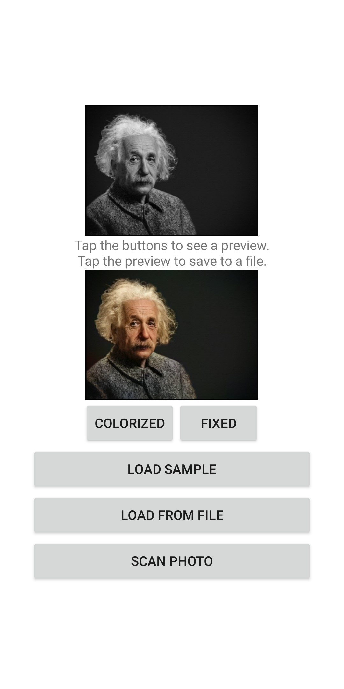

# Colorizer 

**Turn your black and white pictures into color pictures**

Colorizer allows you to scan pictures using Brother scanners or MFC devices or directly from your phone's memory and turn them into black and white images.

Bring new life to old family pictures and restore damaged pictures

# Development Overview

This is a Native Android application targeting SDK version 19 or higher (Android 4.4)

## Developer Setup

A full gradle project is provided but there are dependencies that are not bundled.
**Dependencies:** [Brother Scan SDK Library + Brother Core Library](https://developerprogram.brother-usa.com/sdk-download)
